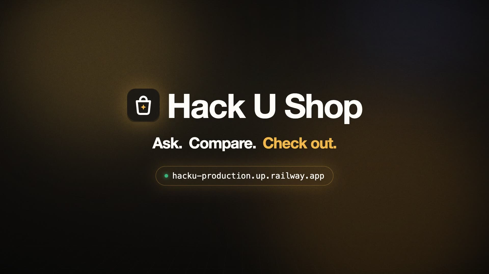
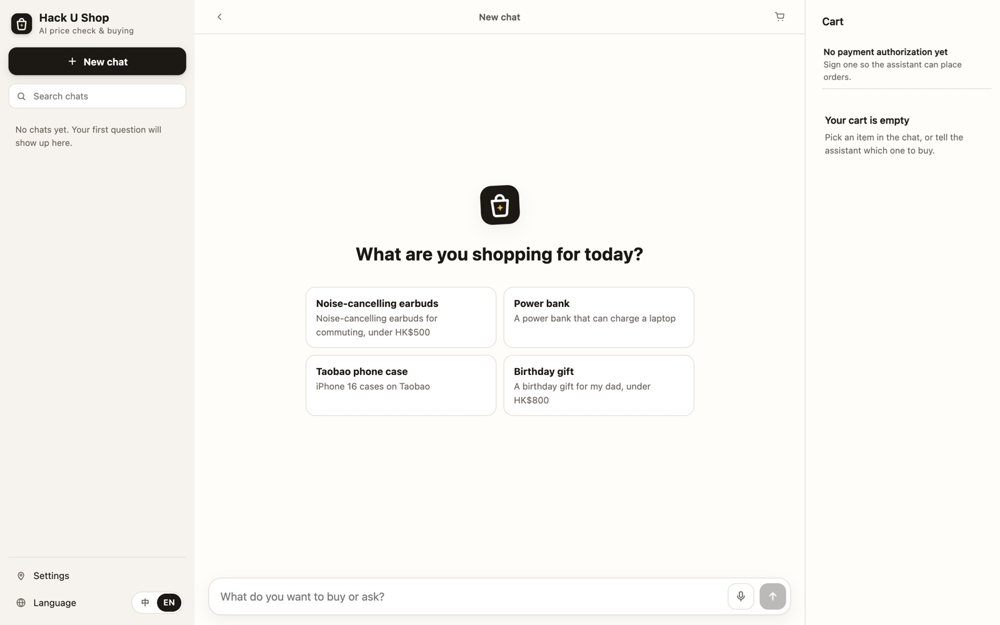
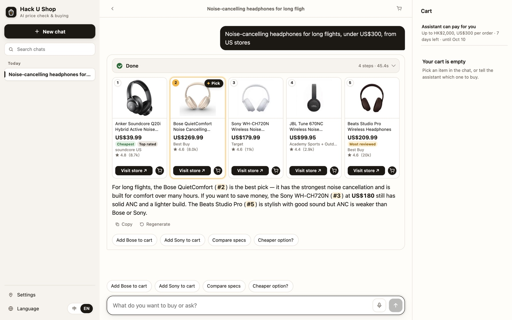
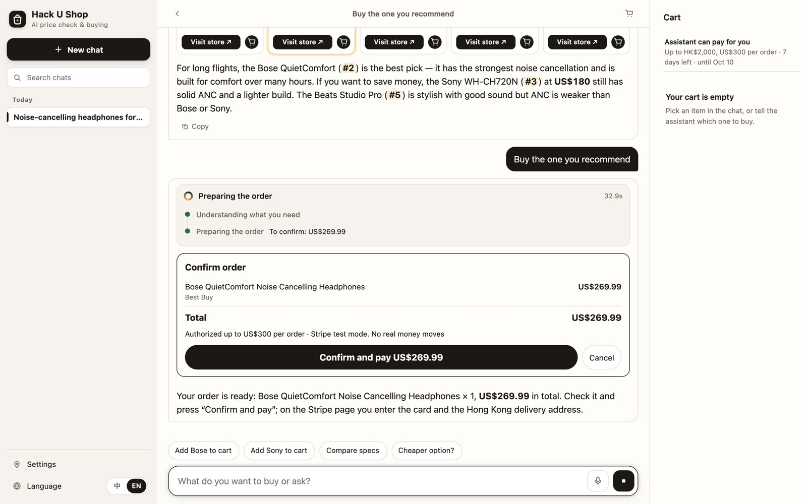
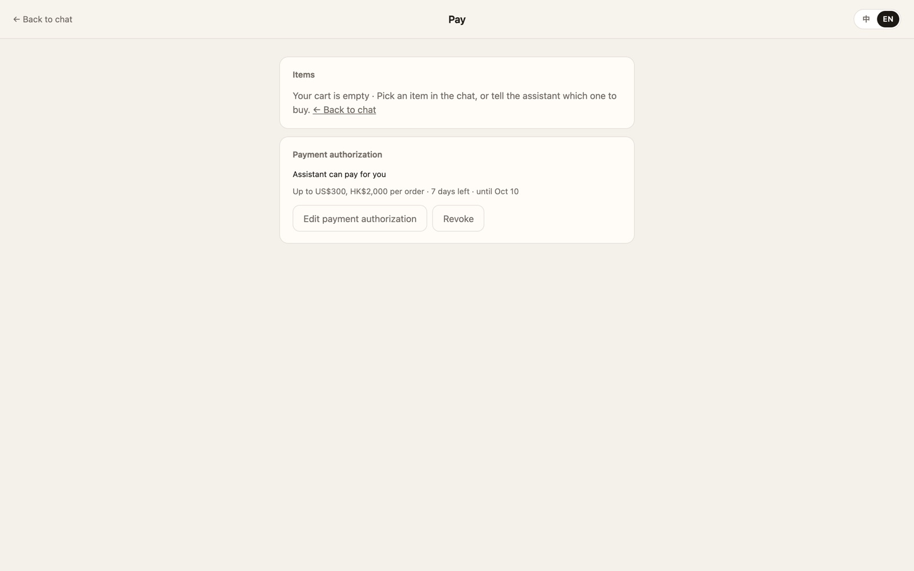
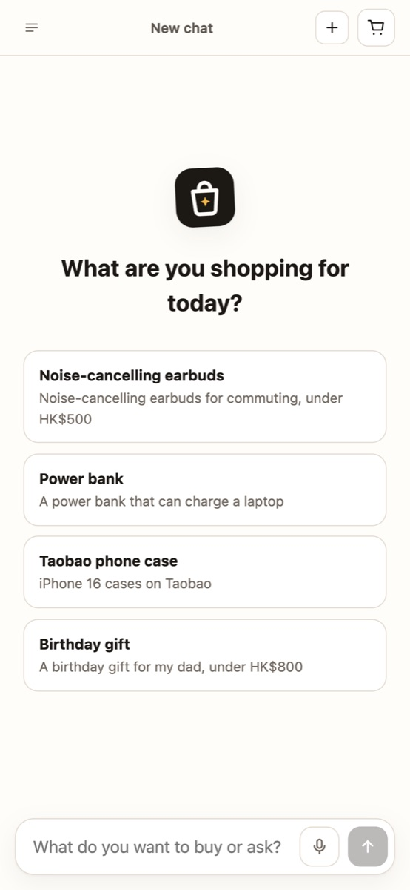
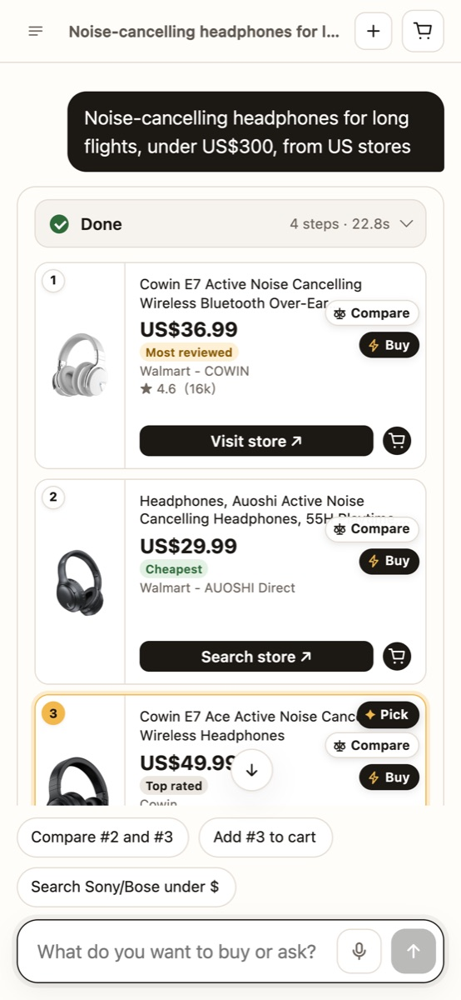

# Hack U Shop

**Ask. Compare. Check out.**

Hack U Shop is an AI shopping agent. You tell it what you want in one sentence, and it searches real stores, shows real products with real prices, picks one and says why, and pays with a card you saved once — only inside a spending limit you signed.

[](https://github.com/alexwaved-code/Hacku-shop-oiiaii/releases/download/demo/Hack-U-Shop-Demo.mp4)

- **Live site:** https://hacku-production.up.railway.app
- **Demo video (88 s, 1080p):** [Hack-U-Shop-Demo.mp4](https://github.com/alexwaved-code/Hacku-shop-oiiaii/releases/download/demo/Hack-U-Shop-Demo.mp4)
- **Pitch deck:** [Hack-U-Shop-Pitch.pptx](https://github.com/alexwaved-code/Hacku-shop-oiiaii/releases/download/demo/Hack-U-Shop-Pitch.pptx)

## Screenshots

**Ask in one sentence.** Chats on the left, cart and spending limit on the right.



**Real products from live US stores.** The agent picks the Bose QuietComfort (#2) for long flights and explains the trade-offs.



**"Buy it."** One sentence. With a saved card, the receipt comes back in the chat.



**Your limit, signed by you.** A cap per order for each currency, with the days left.



**Same agent on your phone.**

<p>
  
  
</p>

## The problem

Buying something online means ten tabs, five stores, and prices you cannot compare. Chatbots can talk about products, but they invent prices, and nobody wants to hand an AI their card.

## What it does

1. **Ask in plain words.** "Noise-cancelling headphones for long flights, under US$300." Chinese or English, on desktop or phone.
2. **It searches live stores.** The agent runs Google Shopping and store searches (Hong Kong by default, or the country or store you name), reads product pages, and shows up to five product cards with picture, price, store, rating, and link.
3. **It picks one, and says why.** The answer names the best card and the trade-off. Cards are tagged "Cheapest", "Most reviewed", "Top rated", and "Pick".
4. **Compare in one click.** A side-by-side sheet for up to three cards. The agent can also ask one or two quick questions (budget, use, a key preference) when the request is vague.
5. **Cart and cap.** Add cards to the cart from the chat or by hand. The cart always shows how much of your per-order limit it uses.
6. **Save a card once.** On the Pay page, Stripe keeps the card. Hack U Shop keeps the brand, the last four digits, and the delivery address from Settings.
7. **"Buy it."** One sentence. The server runs every gate, charges the saved card, and the receipt comes back in the chat: amount, card, address, and record hash. No payment page opens.
8. **Over the cap, or revoked, it stops.** Nothing is charged. The chat names the rule, and the Pay page log records the same rule next to the amount and the cap.

An order desk (`/orders.html`) lists paid orders. For Shopify stores and HKTVmall it can open the store's checkout in Chrome with the items and the delivery address filled in, and stop at the store's payment page so a person places the order. It can also record the store's order number or refund the shopper.

## Why you can trust it

The agent can ask to pay. Only the gates can charge the saved card, and only when every check passes:

| Guard | What it stops |
|---|---|
| **Sealed product cards** | Every card is signed by the server from the cached search result. The model cannot change a price, a store, or a link. |
| **Signed spending mandate** | You set a cap per order for each currency, valid 1 to 30 days. Over the cap, revoked, or expired, and the charge is refused. |
| **Second-model verifier** | Before any charge, a separate model rates every listing (reject, reconsider, accept). Anything short of "accept" is not charged, and a reject starts a 10-minute cooling period. |
| **The rule is logged** | A refusal names the rule that stopped it, in the chat and in the Pay page log, with the total and the cap. |
| **Hash chain** | Every mandate, saved card, payment, refusal, refund, and cooling period is chained in SQLite, so the record cannot be quietly rewritten. |

Text on web pages is treated as data. A page that tries to instruct the agent is flagged to the model and on the card.

## How it works

```
Browser (chat, cart, order desk)
   │  SSE stream
   ▼
web/server.py ── agent/   tool loop: search, read pages, cards, cart, ask, buy
              ├─ pay/     mandate, verifier, saved card, order store, hash chain
              └─ shop/    fills a store's cart in Chrome, stops before payment
```

`agent/`, `pay/`, and `shop/` do not import each other. The server wires them, and hands the agent one payment function. That function runs every gate before Stripe sees the order.

## Stack

- **Model:** Kimi K2.6 through an OpenAI-compatible gateway (any compatible model works)
- **Search:** Serper (Google Shopping, Google Images, Google Search)
- **Payments:** a card saved once on Stripe, charged inside the cap. Stripe Checkout remains for a shopper with no saved card. Test mode by default.
- **Hosting:** Railway
- **Code:** Python standard-library HTTP server, SQLite, plain HTML, CSS, and JavaScript. No framework, no build step.

## Manual versus assistant

Same purchase: one 1 m, 60W USB-C cable, under HK$100, delivered in Hong Kong.

| Route | Time | Steps | Price |
|---|---|---|---|
| Assistant | 42 s | 3 | HK$39 |
| Manual | no upper bound | — | — |

The assistant time is one sentence, one choice, then a receipt on the saved card (Visa ending 4242, Momax Mag.Link, test mode). By hand, the same cable can be sold out, behind a login, or stuck on a checkout button that does not continue. Until a store accepts payment, that route is not finished.

## Try it

Open https://hacku-production.up.railway.app, sign a spending limit on the Pay page, save a card once, and ask for something. Payments run in Stripe test mode: card `4242 4242 4242 4242`, any future date, any CVC.

## Run your own copy

```bash
cp web/.env.example web/.env   # add OPENAI_API_KEY, SERPER_API_KEY, STRIPE_SECRET_KEY (sk_test_...)
python3 web/server.py
```

Tests, from `web/`:

```bash
python3 -m unittest discover -s tests
```

Every tool, route, environment variable, and the full demo script are in [web/README.md](web/README.md).

---

## Team workflow

Four groups share this GitHub repo. GitHub is the only shared board; agents do not open a separate chat.

### First time (once per person)

1. Ask the repo owner for an invite to `alexwaved-code/Hacku-shop-oiiaii`.
2. Clone it:

```bash
git clone https://github.com/alexwaved-code/Hacku-shop-oiiaii.git
cd Hacku-shop-oiiaii
```

3. Find your group (G1–G4) in `collab/groups.md`.
4. Write your group id locally (this file is not committed):

```bash
echo G1 > collab/.agent-id
```

Replace `G1` with your group.

### Every session

```bash
git checkout g1
git pull --rebase origin main
```

Change only the paths your group owns. When a piece works:

```bash
git add …
git commit -m "[G1] Short reason for the change"
git pull --rebase origin main
git push -u origin g1
```

Replace `g1` / `[G1]` with your group.

### Who merges into main

Only the integrator merges `g1`–`g4` into `main`. Nobody else pushes `main`. No force-push.

Full rules are in [COLLAB.md](COLLAB.md). Groups and folders are in [collab/groups.md](collab/groups.md).
